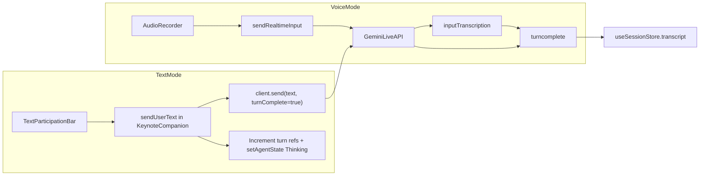

# Add Written Participation Mode

## Current state

Intute is voice-first: mic audio flows through [`ControlTray.tsx`](components/console/control-tray/ControlTray.tsx) → `AudioRecorder` → `client.sendRealtimeInput()`, and turns are finalized in [`KeynoteCompanion.tsx`](components/demo/keynote-companion/KeynoteCompanion.tsx) via `inputTranscription` + `turncomplete`.

There is already a text send path on the Live API client:

```151:157:lib/genai-live-client.ts
  public send(parts: Part | Part[], turnComplete: boolean = true) {
    // ...
    this.session.sendClientContent({ turns: { parts: Array.isArray(parts) ? parts : [parts] }, turnComplete });
  }
```

**Critical constraint:** turn counters (`latestUserTurnIdRef`, stale-response suppression) live inside `KeynoteCompanion` — text sends must go through that orchestrator, not directly from UI components.

## Proposed behavior

| Aspect | Voice mode (default) | Text mode |
|--------|---------------------|-----------|
| User input | Mic stream via `sendRealtimeInput` | Typed message via `client.send([{ text }], true)` |
| Agent output | Audio + transcription (unchanged) | Same — user still hears the teacher |
| Mic button | Mute/unmute | Disabled (mic not used) |
| Status label | "Listening" | "Type to participate" |
| Mid-session switch | Allowed | Allowed — mic stops immediately, text bar appears |



## Implementation plan

### 1. Add participation mode to global state

In [`lib/state.ts`](lib/state.ts):

- Add `ParticipationMode = 'voice' | 'text'`
- Extend `useUI` with `participationMode`, `setParticipationMode`
- Reset to `'voice'` in `useUI.reset()` (session reset)

### 2. Bridge text-send through KeynoteCompanion

Add a small participation bridge in [`lib/state.ts`](lib/state.ts) (or a dedicated `lib/participation.ts`):

```typescript
// Minimal handler registry — lets sibling components send text without duplicating turn logic
registerTextSendHandler: (fn: (text: string) => void) => void
sendUserText: (text: string) => void  // no-op if handler not registered
```

In [`KeynoteCompanion.tsx`](components/demo/keynote-companion/KeynoteCompanion.tsx), register `handleSendUserText` on mount:

- Guard: `connected`, non-empty trimmed text, `participationMode === 'text'`
- Pre-fill `currentUserText.current` with the message (so `handleTurnComplete` commits it even without `inputTranscription`)
- Increment `latestUserTurnIdRef` and `turnCounterRef` immediately (keeps stale-response suppression correct)
- `setAgentState('Thinking')`, perf/debug logging
- `client.send([{ text: message }], true)`
- On mode switch to text while connected: optional whisper via `client.send` informing the agent the user will type

Unregister handler on unmount.

### 3. Update ControlTray for mode switching

In [`ControlTray.tsx`](components/console/control-tray/ControlTray.tsx):

- Read `participationMode` from `useUI`
- Add a toggle button (`keyboard` / `mic` Material icon) next to the existing mic button
- Extend the audio pipeline effect condition:

```typescript
if (connected && !isConnecting && !muted && participationMode === 'voice' && audioRecorder) {
  // start recorder
}
```

- Disable mic mute button when `participationMode === 'text'` (with `title` tooltip: "Switch to voice mode to use the microphone")
- When switching voice → text while connected: force-stop recorder (effect handles this); optionally auto-mute is unnecessary since recorder won't start

### 4. New TextParticipationBar component

Create [`components/console/TextParticipationBar.tsx`](components/console/TextParticipationBar.tsx):

- Renders only when `connected && participationMode === 'text'`
- Single-line `<input>` + Send button (Enter submits, button disabled when empty or agent is mid-turn if needed)
- Calls `sendUserText()` from the participation bridge
- Clears input after successful send
- Accessible: `aria-label`, `data-testid` attributes for future E2E tests

Mount in [`App.tsx`](App.tsx) between `KeynoteCompanion` and `ControlTray`:

```tsx
<KeynoteCompanion />
<TextParticipationBar />
<ControlTray />
```

### 5. Status label update

In [`App.tsx`](App.tsx), when `connected && participationMode === 'text' && !agentState && !isTalking`, show **"Type to participate"** instead of **"Listening"**.

### 6. Styles

In [`index.css`](index.css), add styles for:

- `.text-participation-bar` — full-width bar above control tray, matches `--theme-surface` / `--theme-accent`
- `.participation-mode-button` — reuses `.action-button` patterns
- Mobile: input grows, send button stays tappable (min 44px)

### 7. Copy updates

- [`HelpModal.tsx`](components/HelpModal.tsx): add bullet under "The Basics" explaining the keyboard toggle for users who cannot speak
- [`DESIGN.md`](DESIGN.md): note dual participation modes in section 3.1 (optional, small addition)

## Edge cases to handle

- **Duplicate transcript entries:** Pre-set `currentUserText.current` before `client.send`; `handleTurnComplete` remains the single commit point. If `inputTranscription` also fires for text (unlikely), trim/compare to avoid double-append.
- **Agent still speaking:** If user sends text while agent talks, existing interruption logic (`selfInterruptionDetectedRef`) should still apply; `client.send` with `turnComplete: true` signals a new user turn to the API.
- **Disconnected state:** Hide text bar; mode preference persists until session reset.
- **Mic permission denied:** User can switch to text mode without reconnecting.

## Files to change

| File | Change |
|------|--------|
| [`lib/state.ts`](lib/state.ts) | `participationMode` + text-send handler bridge |
| [`KeynoteCompanion.tsx`](components/demo/keynote-companion/KeynoteCompanion.tsx) | Register `handleSendUserText`, mode-switch whisper |
| [`ControlTray.tsx`](components/console/control-tray/ControlTray.tsx) | Mode toggle, gate mic on `participationMode` |
| [`TextParticipationBar.tsx`](components/console/TextParticipationBar.tsx) | **New** — typed input UI |
| [`App.tsx`](App.tsx) | Mount bar, update status label |
| [`index.css`](index.css) | Bar + toggle styles |
| [`HelpModal.tsx`](components/HelpModal.tsx) | User-facing docs |

## Verification

1. Connect in voice mode — mic works as today
2. Toggle to text mode mid-session — mic stops, text bar appears, status shows "Type to participate"
3. Send a typed question — agent responds with voice, transcript records user text, document/tools update normally
4. Toggle back to voice — mic resumes (if unmuted)
5. Run `npm run build` (or existing type-check script) to confirm no TS regressions
